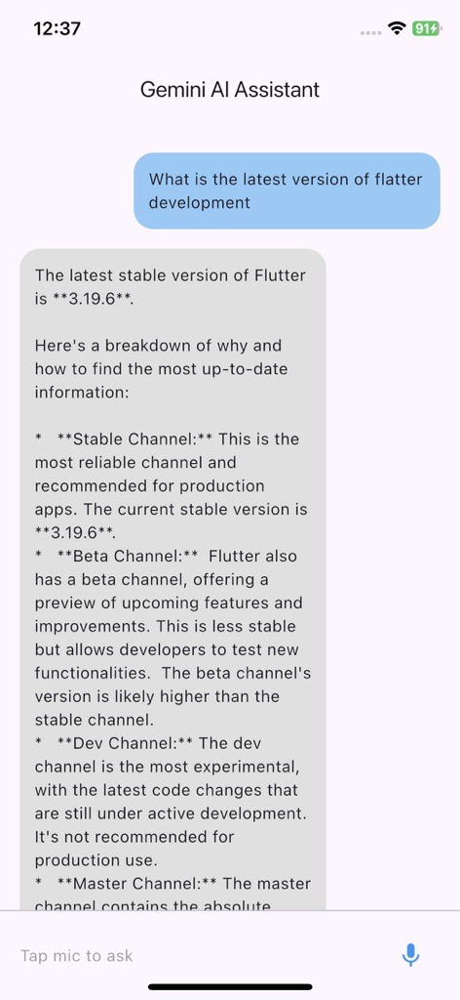

# 🤖 AI Personal Assistant (Flutter + Gemini API)

A simple and elegant Proof of Concept (POC) for a voice-based AI personal assistant built with **Flutter** using **Gemini API** (Google AI). The assistant listens to your voice, processes the query using AI, and responds back using text-to-speech (TTS).

---

## ✨ Features

- 🎙 Voice input with automatic stop when silence detected  
- 🤖 AI-generated response via Gemini API  
- 🔊 Text-to-speech (TTS) response playback  
- 💬 Chat-like UI with user/AI message bubbles  
- 📱 Responsive layout with record button in footer  

---

## 🛠 Tech Stack

- **Flutter** (Dart)  
- **Gemini API** (via REST/SDK)  
- **speech_to_text** for capturing voice  
- **flutter_tts** for speaking response  

---

## 📦 Packages Used

```yaml
speech_to_text: ^7.0.0
flutter_tts: ^4.2.2
http: ^1.3.0
```
---


## 🚀 Getting Started

- Clone this repo
```yaml
git clone https://github.com/your-username/ai-personal-assistant.git
cd ai-personal-assistant
```
- Install dependencies
```yaml
flutter pub get
```
- Add your Gemini API Key
```yaml
const String geminiApiKey = "YOUR_GEMINI_API_KEY_HERE";
```
- 📱 Run the App
```yaml
flutter run
```

## 📷 Screenshots

 